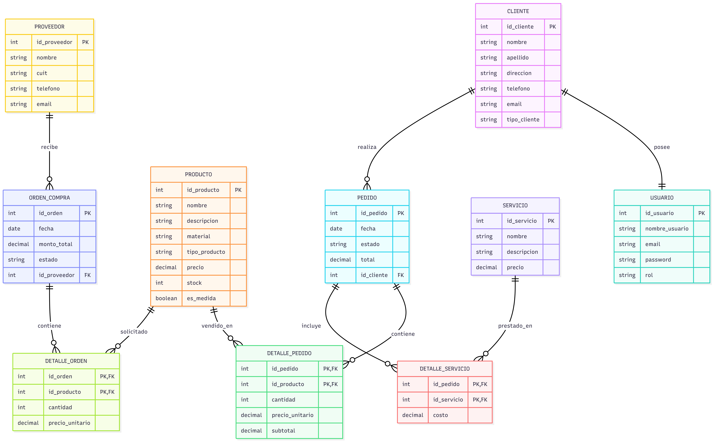

# Trabajo Práctico Anual - Desarrollo Web

## Empresa

Aberturas Los Pampas

## Integrantes

- Máximo Manno
- Alan Grandi
- Román Peralta
- Uriel Scaglia

## Profesor

Pablo Pedernera

## Descripción

El proyecto propone el desarrollo de una plataforma web para la empresa Aberturas Los Pampas con el objetivo de mejorar la gestión comercial, el control de stock, la administración de proveedores y la venta online de productos.

## Contenido

- Presentación de la empresa
- Stakeholders
- Requisitos funcionales y no funcionales
- Historias de usuario
- Casos de uso
- Modelo Entidad-Relación

## DER

## Documentación

- Desarrollo Web - Trabajo Práctico Anual.pdf
